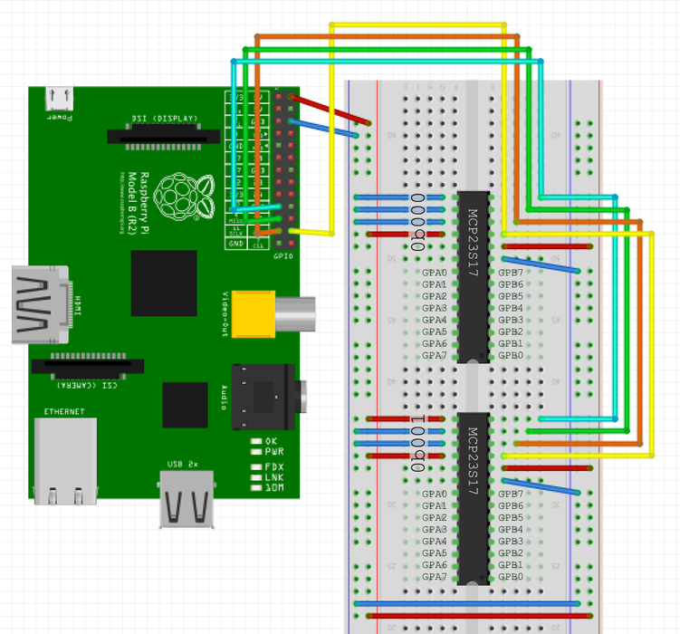
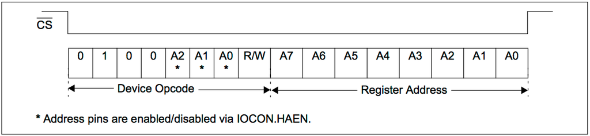

# Pi_MCP23S17

A lightweight Python library and reference guide for using the **MCP23S17 SPI GPIO expander** with a Raspberry Pi. The MCP23S17 is an inexpensive and powerful IC that allows you to expand your Raspberry Pi with up to **16 GPIO pins per chip**, and up to **128 GPIO pins** on a single SPI bus using hardware addressing.

---

## 1. Literature Review / Overview

The **MCP23S17** is a 16-bit I/O expander controlled over the **SPI** bus. Compared to direct GPIO usage, it allows you to control many more inputs and outputs using only a few Raspberry Pi pins.

Key features:

* 16 GPIO pins per IC (GPA0–GPA7, GPB0–GPB7)
* SPI interface (high speed, stable)
* Hardware address pins (A0, A1, A2) allowing up to **8 devices on the same SPI bus**
* Configurable input/output, pull-ups, interrupts

---

## 2. Hardware Setup



### 2.1 Pin Notes and Common Pitfalls

* **MOSI / MISO**: Some breakout boards label these incorrectly. If communication fails, try swapping MOSI and MISO.
* **RESET (~RESET)**: This pin is **active LOW** and **must be pulled HIGH** (3.3V). If left LOW, the chip will not function.
* **A0, A1, A2**: Hardware address pins. These define the chip address on the SPI bus.

  * First chip: `000`
  * Second chip: `001`
  * ...
  * Last chip: `111`
* **GPA0–GPA7 / GPB0–GPB7**: The 16 GPIO pins provided by each MCP23S17.

---

## 3. SPI Communication Basics



The MCP23S17 communicates via **SPI**, which is a master–slave bus protocol. The Raspberry Pi acts as the master.

Important notes:

* Multiple MCP23S17 chips usually **share the same Chip Select (CS)** line
* Individual chips are selected using **A0–A2 hardware address pins**, not separate CS lines
* The Raspberry Pi supports SPI Mode 0, which is compatible with MCP23S17

Enable SPI on the Raspberry Pi using:

```bash
sudo raspi-config
```

Navigate to **Interfacing Options → SPI → Enable**.

---

## 4. MCP23S17 SPI Opcode Format (Technical Details)

To communicate with the MCP23S17, data is sent in **3-byte frames**:

1. **Opcode** (device address + R/W bit)
2. **Register address**
3. **Data byte** (or dummy byte for reads)

### 4.1 Opcode Structure

The opcode format is:

```
0b0100 A2 A1 A0 R/W
```

* `0100` → MCP23S17 fixed hardware ID
* `A2–A0` → Hardware address pins
* `R/W` → Read (`1`) or Write (`0`)

### 4.2 Example Opcode Construction

#### JavaScript Example

```js
var BASE_ADDR = 0b01000000; // 0100xxxx
var A2 = 0, A1 = 0, A0 = 1; // chip address = 001
var READ = 1;              // 1 = read, 0 = write

var opcode = BASE_ADDR | (A2 << 3) | (A1 << 2) | (A0 << 1) | READ;
// Result: 0b01000011
```

---

## 5. Register Usage Notes

* Registers control pin direction, output latch, pull-ups, and interrupts
* Commonly used registers:

  * `IODIRA (0x00)` – Direction for port A
  * `IODIRB (0x01)` – Direction for port B
  * `OLATA  (0x14)` – Output latch A
  * `OLATB  (0x15)` – Output latch B
* To use hardware addressing, set **IOCON.HAEN = 1**

---

## 6. Python Example Library

This project is inspired by:

> [https://github.com/petrockblog/RPi-MCP23S17](https://github.com/petrockblog/RPi-MCP23S17)

The original library did not work reliably in our setup, so this repository contains a **modified and simplified version**.

### 6.1 Requirements

```bash
sudo apt-get install python-dev python-pip
sudo pip install RPi.GPIO
sudo pip install spidev
```

> ⚠️ Note: On modern Raspberry Pi OS versions, Python 3 is recommended:
>
> ```bash
> sudo apt install python3-pip
> pip3 install RPi.GPIO spidev
> ```

---

## 7. Usage

Place `Pi_MCP23S17.py` in the same directory as your script.

```python
from Pi_MCP23S17 import MCP23S17
```

Example usage:

```python
mcp = MCP23S17(bus=0, device=0, address=0)
mcp.setup()
mcp.write_gpioa(0xFF)
mcp.write_gpiob(0x00)
```

---

## 8. Troubleshooting / Gotchas

* Ensure `~RESET` is pulled HIGH
* Enable `IOCON.HAEN` for hardware addressing
* Double-check MOSI/MISO wiring
* Use SPI Mode 0
* Verify A0–A2 pin configuration matches your opcode

---

## 9. License

MIT License

---

## 10. References

* MCP23S17 Datasheet (Microchip)
* SPI Bus Overview – Wikipedia
* Raspberry Pi SPI Documentation
